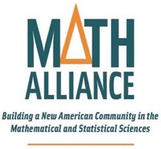

---
# Feel free to add content and custom Front Matter to this file.
# To modify the layout, see https://jekyllrb.com/docs/themes/#overriding-theme-defaults

layout: home
title: Home
---

{: .responsive style="width: 50%; height: auto; margin-left: auto; margin-right: auto; margin: 16px 22px 6px 0;   border-radius: 3% / 10%;   box-shadow: 2px 2px 5px #888;"}
<!--  -->
{: .myClass style=""}

# About us

<!--  -->
Stephen Becker is an associate professor of [applied mathematics at the University of Colorado Boulder](https://www.colorado.edu/amath/). Previously he was a Herman Goldstine Postdoctoral fellow in Mathematical Sciences at IBM Research in Yorktown Heights, NY, and a postdoctoral fellow via the [Fondation Sciences Mathématiques de Paris](http://www.sciencesmaths-paris.fr/) at Paris 6. He received his PhD in 2011 from Caltech under [Emmanuel Candès](http://www-stat.stanford.edu/~candes/).

More information about us at [people](people); we also have the old (and infrequently updated)  [google site member page](https://sites.google.com/colorado.edu/becker/members).

### Contact info

<table class="imgtable" style="border: 0px; float: right; width: 150px;">
<tr><td id="mouse">&nbsp;</td></tr>
</table>
<!--

-->
- Email: `stephen.becker@colorado.edu`
- Office telephone: +1 (303) 669 8379
- Office: 338 ECOT (Engineering Center, office tower). For help finding your way to the office tower, see [engineering center map](https://www.colorado.edu/amath/faculty-staff/visiting).

## Group Research site

Please note: this website `amath.colorado.edu/faculty/becker` (also mirrored via github pages) is being (slowly) deprecated in favor of a more homogenous [faculty website](https://www.colorado.edu/amath/becker).

Yet another website is our
[research group website](https://sites.google.com/colorado.edu/becker/) with public information about our research activities as well as our group's internal collaboration tools.

My CV is on my [CU Experts Profile page](https://experts.colorado.edu/display/fisid_154263).

## Quick links

Proud member of the [Math Alliance](https://www.mathalliance.org/)
- Interested in undergrad research with our group? Here are some programs you can use to get funding (typical ones I've worked with in the past: UROP, SMART, DLA)
  - For CU A&S students, see [A&S student funding opportunities](https://www.colorado.edu/artsandsciences/research/student-resources/undergraduate-student-resources/student-funding-opportunities)
  - For CU engineering students, see [CEAS student funding opportunities](https://www.colorado.edu/engineering/students/research)
- Our new page on [optimization classes and resources at CU](https://sites.google.com/colorado.edu/optimization)
- The [RCDS](http://ecee.colorado.edu/~pao/rcds/) seminar website (for Robotics, Controls, and Dynamical Systems)
- [Statistics, Optimization, Machine Learning seminar](https://sites.google.com/colorado.edu/statoptml/) usually at 3:30 PM every Tuesday in Newton Lab (on pause Fall '22 for  sabbatical)

## News updates
As of October 2022, the website is built with Jekyll and we'll have blog-post style news updates. Here's a summary of old updates

A similar list of announcements is at the [Announcements Page of our Google Site](https://sites.google.com/colorado.edu/becker/announcements)
- Fall 2022, Stephen is on **sabbatical** at [Institut Montpellierain Alexander Grothendieck (IMAG)](https://imag.umontpellier.fr/) in Montpellier France. He will return to Boulder by January 2023.
- [Call for papers: special issue on Big Scientific Data and Machine Learning in Science  and Engineering](https://home.liebertpub.com/cfp/big-scientific-data-and-machine-learning-in-science-and-engi/344/), submission deadline Feb 1 2022
- Summer internships for 2022
  - Kevin at NSA
  - Jacob at LLNL
- Summer internships for 2021
  - Richie will intern at Argonne national labs
  - Liam will intern for IBM Research Dublin again
  - Akshay will intern at NIST
  - Kevin... TBD
  - Erik and Osman will have graduated
- August 2020, Leo defends his PhD thesis
- Stephen will be speaking at the [AIMS South Africa Spring School on Mathematics of Data Science](https://aims.ac.za/event/spring-school-on-mathematics-of-data-science/) in  September 2019 ([ SIAM article describing AIMS](https://sinews.siam.org/Details-Page/aims-advances-mathematics-education-in-africa-1))
- Summer internships for 2020
  - Liam is working for IBM Research Dublin
  - Osman is working for Fujitsu
  - Erik is working for Archer Dx
- Summer internships for 2019
  - Zhishen (Leo) Huang at Respond Software
  - Richie Clancy at Sensory, Inc
  - David Kozak at University of Genova working with Lorenzo Raso (MIT/Genova)
  - Osman Malik at IBM Research with Lior Horesh and Misha Kilmer
- April 2019, Matt Maierhofer and Marc Thomson defend their Masters theses
- April 2019, Jessica Gronski and Eric Kightley defend their PhD
- November 2018, Richard Border defends his Masters thesis
- October 2018, James defends his PhD. Congratulations James!
- June 2018, Stephen is a CCIMI Distinguished Visitor at Cambridge, giving a [CCIMI short-course](http://www.talks.cam.ac.uk/show/index/86806)
- Summer internships for 2018
  - Jessica Gronski at Savvy Sherpa (now United Health Care)
  - Eric Kightley at Respond Software
  - Leo Huang at USC
- May 2018, Farhad departs to take a tenure-track position in CS at [U. Mass Lowell](https://www.uml.edu/)
- January 2018, Stephen is one of four founding members of the [Imaging Science IRT](https://www.colorado.edu/engineering/research/interdisciplinary-research-themes)
- Spring 2017, Farhad Pourkamali-Anaraki gradautes with his PhD, staying with us for another year as a postdoc
- Spring 2017, Derek Driggs graduates with his MS, heads to Cambrdige in October
- January 2017, group member Derek Driggs (BS/MS) awarded a Cambridge Gates Fellowship (4 year fellowship to Cambridge for a PhD).
- Jan 2017, our group awarded a contract for signal processing algorithms with Northrop Grumman
- May 2016, our group awarded a gift from the Bloomberg data science program
- March 2016, [Alex Gittens](https://www.cs.rpi.edu/~gittea/) and [Michael Mahoney](https://www.stat.berkeley.edu/~mmahoney/) visit
- March 2016, students have summer internship offers from the following companies:
  - [Technicolor research (Bay Area)](http://www.technicolorbayarea.com/), Farhad Pourkamali-Anaraki
  - [Sandia National Lab with Tamara Kolda](https://www.mathsci.ai/), Jessica Gronski
  - [ICR](http://icr-team.com/), James Folberth
- July 12 2015, with Michael Grant and Emmanuel Candes, we have won the [Beale-Orchard-Hays prize](http://www.mathopt.org/?nav=boh) at ISMP 2015
- June 24 2015, selected for 2015 ICML Reviewer award
- Summer 2015, organizing the [Workshop on Robust Subspace Learning and Computer Vision RSL-CV](http://rsl-cv2015.univ-lr.fr/workshop/) at ICCV 2015 (Santiago, Chile).
- Nov. '14, we have free software available for our [robust PCA algorithm](https://github.com/stephenbeckr/fastRPCA) at NIPS 2014 in Montreal.
- Sept. '14, two papers accepted at NIPS
- Organizing [ NIPS 2014 "Out of the box: robustness in high dimension"](https://sites.google.com/site/saravkin/nips2014-robust) workshop at NIPS 2014 in Montreal.

### Interesting links, updated at least once per decade
- [Good color schemes](https://personal.sron.nl/~pault/data/colourschemes.pdf) for scientific documents
- [CU Math department's DeLong lecture series](http://math.colorado.edu/delong/)
- [Google Scholar's classic papers](https://scholar.googleblog.com/2017/06/classic-papers-articles-that-have-stood.html)
- [Machine Learning courses at CU](http://www.cs.colorado.edu/~mozer/Teaching/Machine%20Learning%20At%20CU/)
  - Update April 2022: see the [new ML resources website](https://www.colorado.edu/research/machine-learning/) for info on ML at CU
- [CS department colloquium](http://www.colorado.edu/cs/colloquia/colloquium-schedule)
- [Simons Institute youtube channel](https://www.youtube.com/channel/UCW1C2xOfXsIzPgjXyuhkw9g) for interesting talks on a range of subjects
- [MMDS Foundation youtube channel](https://www.youtube.com/channel/UCmLB71obuOBLMdWCQUI-DiA) for talks on big-data topics
- [Gene Golub summer school](http://scgroup19.ceid.upatras.gr/g2s32015/2015/04/16/welcome/), 2015 is on randomization in numerical linear algebra
